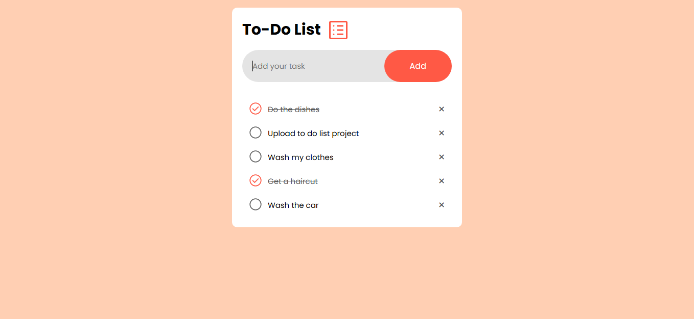
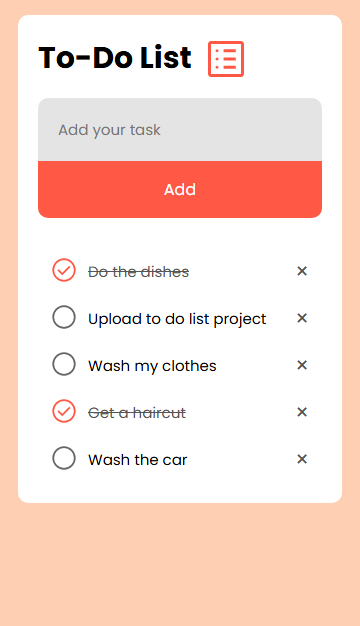
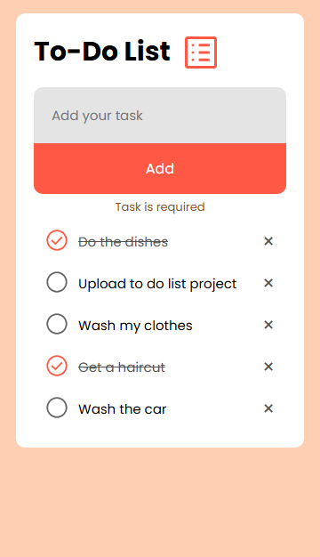

# 📋 To-Do List

A simple to-do list application built with HTML, CSS, and JavaScript. Tasks are stored locally in the browser using Local Storage.

## 📌 Features

- Add new tasks.
- Mark tasks as complete.
- Delete tasks.
- Data persistence with Local Storage.

## 🚀 Technologies Used

- HTML
- CSS
- JavaScript (Vanilla JS)
- Local Storage

## 📸 Screenshots

##### 1. Desktop Display



##### 2. Mobile Display



##### 3. Active Alert Message



## 🧱 Project Structure

```
/weather-app
│── design/ # Screenshots of the different app states
│── icons/  # Icons used in the interface
│── index.html
│── style.css
│── script.js
│── README.md
│── .gitignore
```

## 🛠 Installation and Use

1. Clone this repository:

```bash
git clone https://github.com/your-username/your-repository.git
```

2. Open the `index.html` file in your browser.

## 👨‍💻 Author

Developed by [Juan Amador](https://github.com/juanamador1009)
